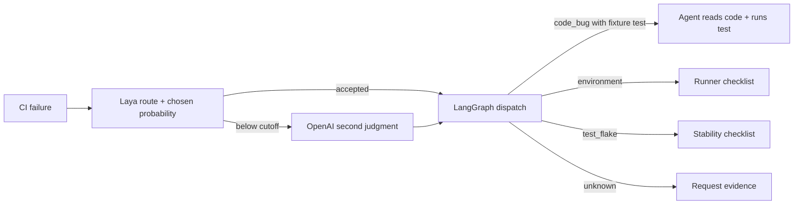

# System One Lab: Laya + LangGraph coding-agent demo

This application shows a bounded System-1 decision inside a coding-agent workflow. Laya classifies CI failures as `code_bug`, `environment`, `test_flake`, or `unknown`. LangGraph applies an exploratory fallback policy and dispatches the result. For a reproducible code failure, a LangChain/OpenAI agent reads a small fixture repository, runs the specific failing test, and proposes a fix. The tools are read-only; the agent does not modify the fixture.

The Streamlit app also compares **Laya**, **Laya plus OpenAI fallback**, **OpenAI-only**, and **simple keyword rules** on the same eight cases. It shows accuracy, model calls, token usage, stage timing, and the effect of different probability cutoffs. A second button runs three complete workflows independently on one selected case, including downstream agent calls and wall time. Real LangGraph node updates are displayed as they occur. The earlier support-ticket example remains in a separate tab.



## Run the app

Python 3.12 was used for development:

```bash
python3 -m venv .venv
.venv/bin/python -m pip install -r requirements.txt
cp .env.example .env
# Set OPENAI_API_KEY in .env for the OpenAI comparisons and coding agent.
.venv/bin/streamlit run app.py
```

The first local Laya call downloads checkpoint weights unless `HF_HOME` points to an existing cache. The app runs Laya and the rules baseline without an OpenAI key; OpenAI-only and complete three-way comparison require one. `.env` is ignored by Git. `OPENAI_MODEL` defaults to `gpt-5.6-luna` and uses the Responses API for tool calling.

In **Coding agent**, click **Compare triage on all 8 failures**. The first three cases summarize actual failures from `fixtures/cart_project`; the other five are synthetic CI summaries. Inspect mismatches and the cutoff sweep. Then select **Zero quantity** and click **Run Laya-guided workflow**: at the default exploratory cutoff, Laya routes it directly to the coding agent. The agent reads `cart.py` and `tests/test_cart.py`, runs the failing test, and explains the bug. **Discount regression** shows an OpenAI second judgment before the agent. **Compare complete workflows** runs all three routes on the selected case and reports their measured wall times and model/tool calls.

The cutoff of 0.55 is an **in-sample demo setting**, chosen while inspecting this fixture. It is not calibrated or validated for deployment. The cutoff sweep shows accepted errors and coverage on these same eight examples only. Use separate, representative failures to select and validate any real fallback policy. Laya's `answer_confidence` is the chosen label probability; its generic `confidence` is a different entropy-based score.

## Deploy the batch adapter behind ingress

The stock `laya-serve` endpoint accepts one state per `POST /v1/systemone`. For remote batching, run the included resident adapter on the machine with Laya weights:

```bash
export LAYA_API_KEY='choose-a-server-secret'
.venv/bin/uvicorn batch_server:app --host 0.0.0.0 --port 8001
```

Expose port 8001 through your ingress, then set these values in the **Streamlit app's** `.env`:

```dotenv
LAYA_BATCH_BASE_URL=https://your-laya-batch-host.example
LAYA_API_KEY=the-same-server-secret
```

Restart Streamlit. The app sends one authenticated `POST /v1/batch` containing up to 64 short reports; the server keeps one local `Router` resident and calls `Router.predict_batch`. `GET /health` and `POST /v1/batch` both require the bearer token when `LAYA_API_KEY` is set. Keep TLS and access controls at ingress. The adapter accepts 1–4000 characters per report and 2–8 choice labels. It is intentionally a small demonstration service, not a general public inference API.

If you have only stock `laya-serve`, set `LAYA_BASE_URL` instead. That path is supported, but the app sends one HTTP request per report and labels it **remote sequential HTTP**. `LAYA_BATCH_BASE_URL` takes precedence when both are set. The app's keys stay server-side.

## What was measured here

On one CPU run of the eight coding summaries, Laya matched **5/8**, the rules matched **7/8**, OpenAI-only matched **8/8**, and Laya plus fallback matched **8/8** with five OpenAI classification calls instead of eight. Laya's local batch took about **15 seconds** with checkpoint loading; the summed classification-stage times were about **21.7 seconds** for Laya plus fallback and **11.1 seconds** for OpenAI-only. The hybrid saved three classification calls on this set but was slower on this CPU. These are one-run observations, not a general benchmark.

For the **Zero quantity** case, three independently executed complete workflows all found the code bug. One run took about **9.5 seconds** with Laya (two OpenAI model calls in the downstream agent), **6.4 seconds** with OpenAI-only (three calls including classification), and **6.2 seconds** with rules (three agent calls). Agent token counts differ between runs because responses are generated independently. The batch comparison reuses the OpenAI-only classifications as fallback results to avoid paying twice; its displayed stage-time sum is **not** an independently measured end-to-end wall time. The complete-workflow comparison is measured independently.

The fixture is small and partially synthetic. Its rules baseline is strong, and the CPU Laya path did not win on latency. That is the useful lesson for a demo: decide whether a System-1 route earns a place using representative data and complete workflow measurements, rather than assuming it will. Laya's own [evaluation guide](https://github.com/NandhaKishorM/laya/blob/main/docs/evals.md) and [documented limits](https://github.com/NandhaKishorM/laya/blob/main/README.md#honest-limits) give more context.

## Verify

```bash
.venv/bin/python -m pytest -q
cd fixtures/cart_project && ../../.venv/bin/python -m pytest tests/test_cart.py -q
```

The root tests should pass. The cart fixture should report three intentional failures and one pass. To run Laya without OpenAI, use `.venv/bin/python smoke.py` for the support example or the app's coding comparison without a key. The batch adapter has an authenticated FastAPI test and was also exercised over a live HTTP server with two reports in one request.

For a 20–30 minute talk: show the real fixture failure (3 minutes), batch comparison and cutoff sweep (7 minutes), streamed coding-agent investigation (7 minutes), full workflow comparison (5 minutes), and the remote batch request plus limitations (3 minutes). The implementation seams are `demo/coding_data.py` (finite decision), `demo/coding_workflow.py` (routing and baselines), `demo/coding_agent.py` (restricted tools), and `batch_server.py` (remote batch transport).

Primary implementation references: [Laya](https://github.com/NandhaKishorM/laya), [LangGraph streaming](https://docs.langchain.com/oss/python/langgraph/streaming), [LangChain agents](https://docs.langchain.com/oss/python/langchain/agents), [LangChain OpenAI integration](https://docs.langchain.com/oss/python/integrations/chat/openai).
