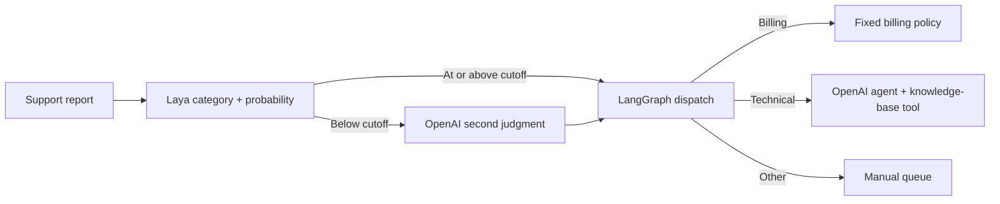

# Laya + LangGraph Support Ops Lab

A runnable application for showing how a small decision model fits into an agent workflow. Laya classifies a queue of support reports into `billing`, `technical`, or `other`. LangGraph applies a chosen probability cutoff and dispatches each report. Only an uncertain report gets an OpenAI second judgment. A technical report then goes to a LangChain agent with a `search_knowledge_base` tool. The app displays the route, probabilities, tool calls, and source topics.

The batch screen uses 14 synthetic, labeled reports, including negations and out-of-scope requests. It shows wrong predictions rather than hiding them. The workflow screen follows one report into the agent. No customer message is sent and no account action is taken.



## Run locally

With Python 3.12 (tested here):

```bash
python3 -m venv .venv
.venv/bin/python -m pip install -r requirements.txt
cp .env.example .env
# Put OPENAI_API_KEY in .env for the OpenAI branches.
.venv/bin/streamlit run app.py
```

Open the Streamlit URL shown in the terminal (normally <http://localhost:8501>). Click **Run Laya triage**, then pick **Duplicate charge** to show the no-OpenAI route. Pick **API error** to show a low-confidence second judgment followed by an agent tool call. **Settings crash** demonstrates a technical investigation without a second judgment. Increase or decrease the cutoff to show how the path changes; it is a demonstration knob, not a calibrated production threshold.

The first local run downloads Laya weights unless `HF_HOME` points to a cache. In the original development workspace, the cache is `/home/ncbernar/workspace/laya-eval/hf-cache`; other users can omit this setting. Without `OPENAI_API_KEY`, Laya triage and fixed routes still work; low-confidence reports go to manual review and technical reports are queued without agent investigation. Keep `.env` private; it is ignored by Git. `OPENAI_MODEL` defaults to `gpt-5.6-luna` and is configurable in `.env`. The OpenAI integration uses the Responses API so this model can call the playbook tool.

## Use a deployed Laya endpoint

Set the *root* URL of a running `laya-serve` instance in `.env`:

```dotenv
LAYA_BASE_URL=https://laya.example.com
LAYA_API_KEY=your-laya-bearer-token
```

Restart Streamlit after changing the connection. The app calls `POST /v1/systemone` and passes `LAYA_API_KEY` as a bearer token. The current `laya-serve` protocol has no multi-state batch endpoint, so the remote mode makes one HTTP request per report; the UI labels this as **remote sequential HTTP**. Local mode uses `Router.predict_batch` and groups the reports into a Laya batch. The key and URL are read on the application server; the app never puts the key in a browser request.

## Live demo plan (20–30 minutes)

1. **Problem (3 min):** Show 14 reports and the fixed three-label decision. Explain why only short, bounded classification goes to Laya.
2. **Batch (5 min):** Run triage, inspect chosen-label probability, errors, cutoff coverage, and local versus remote call count. Show the two mismatches.
3. **Handoff (8 min):** Run Duplicate charge, API error, and Settings crash. Compare decision traces and playbook tool calls.
4. **Implementation (5 min):** Walk through `demo/laya_gateway.py`, `demo/workflow.py`, and `demo/openai_agent.py`. The graph makes the fallback and agent call explicit.
5. **Discussion (4 min):** Change the cutoff, discuss a held-out evaluation and the endpoint's lack of batch support. Compare complete workflow latency and correctness before making cost or performance claims.

## Verification and limits

Run `.venv/bin/python smoke.py` for the real Laya batch, and `.venv/bin/python -m pytest -q` for the gateway and graph behavior. In the development workspace on CPU, one 14-report local batch with a cold checkpoint took **12.64 seconds**, and Laya matched **12/14** synthetic reference labels. These are observations from one small fixture, not a model benchmark. One live workflow run used **zero** OpenAI stages for a confident billing report; an API error used a second judgment and then one knowledge-base tool call. The agent itself may make multiple model API requests in a stage.

The current label probability is not a guarantee of correctness. Laya's `answer_confidence` is the chosen label probability; its generic `confidence` is a different entropy-based measure. The sample labels, cutoff, and tiny knowledge base should be replaced with domain data, held-out evaluation, and real playbooks before production use. The app intentionally records no customer content and does not connect to a ticket system.

Primary references: [Laya source](https://github.com/NandhaKishorM/laya), [LangGraph workflow guide](https://docs.langchain.com/oss/python/langgraph/quickstart), [LangChain agents](https://docs.langchain.com/oss/python/langchain/agents), [LangChain OpenAI integration](https://docs.langchain.com/oss/python/integrations/chat/openai), [OpenAI API quickstart](https://developers.openai.com/api/docs/quickstart).
